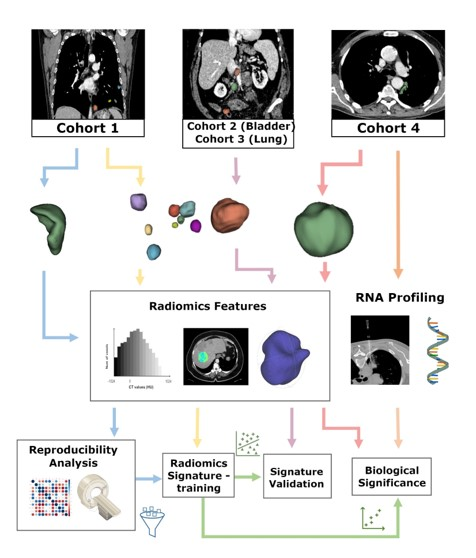

# Immuno-CTrad

This pipeline is developed to train and test a CT-radiomics based signature for predicting response to immunotherapy. The radiomics score is associated with gene expression profiling for biological validation purpose.
The structure of the pipeline is represented in the following figure:

1. Extraction of radiomics features 
2. Feature selection based on reproducibility (ICC analysis) - [_ImmuneCT_RAD_training.R_]
3. Elastic-net feature selection + mixed model building - [_ImmuneCT_RAD_training.R_]
4. External Validation in two databases (Genitourinary bladder cancer and Lung cancer populations) - [_ImmuneCT_RAD_training.R_]
5. Patient level analysis (different lesions per patient) - [_ImmuneCT_RAD_PatLevelValidation.R_]
6. Logistic regression model combining Radiomic score with clinical variables - [_ImmuneCT_RAD-clin_training.R_]
7. Prognostic value of the Clinical + Radiomics model predicting overall survival - [_ImmuneCT_RAD-clin_training.R_]
8. Biological validation of Radiomics score with gene expression profiling data - [_ImmuneCT_RAD-RNASeq.R_]

## Data

The images correspond to patients treated with immune checkpoints inhibitors (Anti-PD1/PD-L1) in Phase I/II/III clinical trials at Vall d'Hebron Institute of Oncology (VHIO).

For Data access please contact the radiomics team at VHIO: radiomicsvhio@vhio.net
